# 家用电器运行原理与故障修复指南

## 引言

在现代社会中，各种各样的家用电器已经成为我们日常生活中不可或缺的一部分。从清晨的一杯热水，到夜晚的舒适睡眠，再到厨房里的美味佳肴，各种电器为我们的生活带来了极大的便利。然而，当这些电器出现故障时，我们往往束手无策，只能依赖维修人员，既费时又费钱。

本文将详细介绍家用电器的运行原理、主要部件、常见故障及修复方法、最佳使用实践和维护建议，帮助您更好地了解和使用这些家用电器，延长其使用寿命，提高使用效率。

## 一、制冷类电器

### 1. 冰箱

冰箱是现代家庭中最重要的制冷设备之一，通过蒸汽压缩式制冷循环实现制冷功能。

#### 运行原理

冰箱的制冷循环包含四个主要过程：

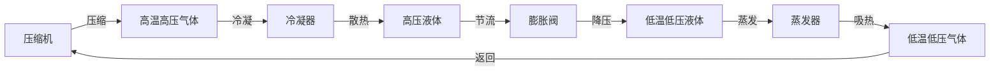

1. **压缩过程**：压缩机将低温低压的制冷剂气体压缩成高温高压气体
2. **冷凝过程**：高温高压气体在冷凝器中散热，变成高压液体
3. **节流过程**：高压液体经过膨胀阀降压，变成低温低压液体
4. **蒸发过程**：低温低压液体在蒸发器中吸收热量，实现制冷

#### 主要部件

- **压缩机**：制冷系统的动力源，将低温低压气体压缩成高温高压气体
- **冷凝器**：位于冰箱背部或底部，负责散热
- **膨胀阀/毛细管**：控制制冷剂流量，实现节流降压
- **蒸发器**：位于冰箱内部，负责吸热制冷
- **温控器**：控制压缩机启停，保持设定温度
- **门封条**：密封冰箱门，防止冷气外泄

#### 常见故障及修复

**故障1：冰箱不制冷**

可能原因：
- 压缩机故障
- 制冷剂泄漏
- 温控器损坏
- 冷凝器积尘严重

修复方法：
1. 检查压缩机是否运转，如有嗡嗡声但不制冷，可能是压缩机故障
2. 检查制冷剂管路是否有油迹，判断是否泄漏
3. 检查温控器设置，尝试调整温度
4. 清理冷凝器灰尘，保持通风良好

**故障2：冰箱结冰严重**

可能原因：
- 温控器设置过低
- 门封条老化漏气
- 使用频率过高
- 门开关频繁

修复方法：
1. 调高温控器设置
2. 检查门封条，老化则更换
3. 减少开门次数
4. 检查门开关是否正常

#### 最佳使用实践

- 食物冷却后再放入冰箱，避免增加冰箱负荷
- 不要塞得太满，保持空气流通
- 定期清理冰箱内部，保持清洁
- 定期清理冷凝器灰尘，保持散热良好
- 避免将热食物直接放入冰箱

#### 维护建议

- 每月清理冰箱内部一次
- 每季度清理冷凝器灰尘
- 每年检查门封条密封性
- 避免在冰箱顶部堆放重物

---

### 2. 空调

空调通过热泵原理实现制冷和制热功能，是调节室内温度的重要设备。

#### 运行原理

空调制冷循环与冰箱类似，但通过四通换向阀可以实现制冷和制热两种模式的切换。

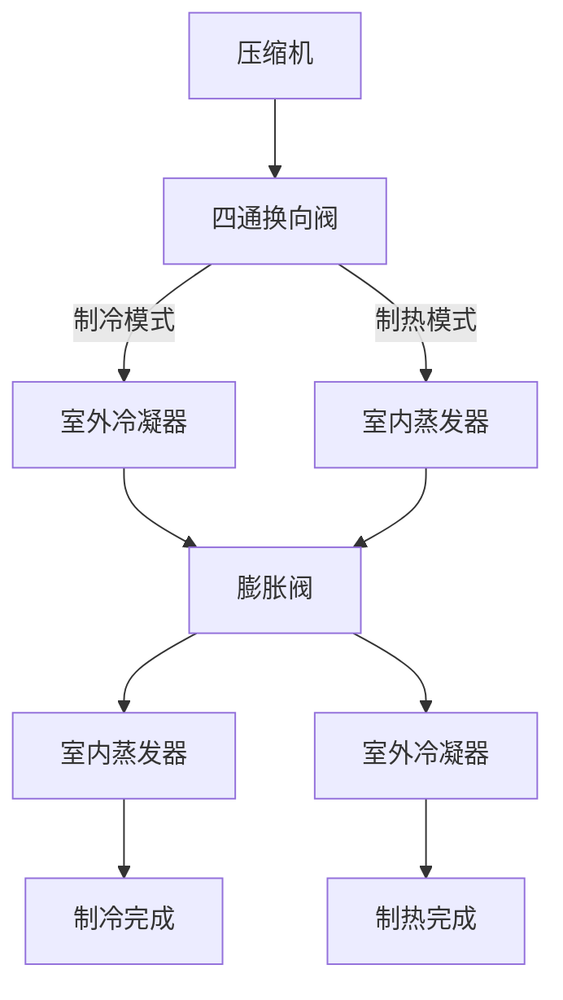

#### 主要部件

- **压缩机**：制冷系统的心脏
- **四通换向阀**：切换制冷/制热模式
- **室外机**：冷凝器、风机
- **室内机**：蒸发器、风机
- **膨胀阀/毛细管**：节流降压
- **控制板**：控制整机运行

#### 常见故障及修复

**故障1：空调不制冷**

可能原因：
- 制冷剂不足
- 室外机散热不良
- 过滤网堵塞
- 压缩机故障

修复方法：
1. 检查制冷剂压力，补充制冷剂
2. 清理室外机散热片
3. 清洗室内机过滤网
4. 检查压缩机运转情况

**故障2：空调漏水**

可能原因：
- 排水管堵塞
- 室内机安装不当
- 接水盘破损

修复方法：
1. 清理排水管
2. 调整室内机安装角度
3. 更换接水盘

#### 最佳使用实践

- 夏季制冷温度设置在26-28℃，冬季制热设置在20-22℃
- 定期清洗过滤网
- 使用空调时关闭门窗
- 长期不使用时拔掉电源

#### 维护建议

- 每月清洗过滤网一次
- 每季度清洗室外机散热片
- 每年检查制冷剂压力
- 使用3年后请专业人员检查整机

---

## 二、厨房电器

### 1. 电饭煲

电饭煲通过精确控制温度完成煮饭过程，是厨房中必备的电器之一。

#### 运行原理

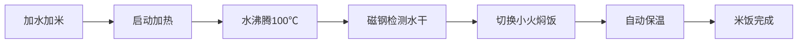

电饭煲通过智能温度控制完成煮饭过程：
1. **加热阶段**：大功率加热盘快速加热水至沸腾（100℃）
2. **焖饭阶段**：温度传感器检测到水干后，转为小火焖饭
3. **保温阶段**：煮饭完成后，自动切换到保温模式（60-80℃）

#### 主要部件

- **内胆**：铝合金或铁釜，负责直接加热水和米
- **加热盘**：铸铁或铝合金，将电能转化为热能
- **温度传感器**：检测内胆底部温度，控制加热过程
- **磁钢限温器**：检测沸腾状态，控制焖饭切换
- **控制电路板**：微电脑芯片，控制整个煮饭程序

#### 常见故障及修复

**故障1：电饭煲不加热**

可能原因：
- 电源问题
- 保险丝烧断
- 控制板故障
- 内部线路断开

修复方法：
1. 检查电源线和插座
2. 检查保险丝是否熔断
3. 检查控制板供电
4. 检查内部接线

**故障2：煮饭夹生/糊底**

可能原因：
- 温度传感器故障
- 磁钢限温器失灵
- 加热盘表面有异物

修复方法：
1. 清洁加热盘表面
2. 检查内胆底部是否平整
3. 检查温度传感器
4. 检查磁钢限温器

#### 最佳使用实践

- 米水比例适当，一般为1:1.2-1.5
- 煮饭前将米浸泡15-30分钟
- 选择合适的煮饭模式
- 煮饭后继续焖10-15分钟再开盖
- 及时清洁内胆，用软布擦拭

#### 维护建议

- 使用软布清洁内胆，不要用钢丝球
- 定期清洁蒸汽阀
- 清洁后保持内胆干燥
- 避免干烧

---

### 2. 电磁炉

电磁炉利用电磁感应原理加热，是一种高效、安全的烹饪电器。

#### 运行原理

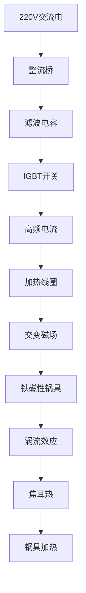

电磁炉利用电磁感应原理加热：
1. **电磁感应**：高频电流通过线圈产生交变磁场
2. **涡流效应**：交变磁场在铁磁性锅具底部产生涡流
3. **焦耳热**：涡流在锅具电阻上产生热量，实现加热

#### 主要部件

- **加热线圈盘**：产生交变磁场的核心部件
- **IGBT管**：大功率开关器件，控制加热功率
- **整流桥**：将交流电转换为直流电
- **滤波电容**：平滑直流电压
- **控制面板**：设置功率、温度、功能等
- **温度传感器**：检测炉面温度和锅具温度
- **散热风扇**：为IGBT和线圈盘散热

#### 常见故障及修复

**故障1：电磁炉不工作**

可能原因：
- 电源问题
- 保险丝烧断
- IGBT管击穿
- 控制板故障

修复方法：
1. 检查电源线和插座
2. 检查保险丝是否熔断
3. 检查锅具是否合适（铁磁性）
4. 清洁炉面油污

**故障2：加热不稳定**

可能原因：
- 锅具不合适
- 温度传感器故障
- 散热不良

修复方法：
1. 更换合适的铁磁性平底锅
2. 清洁炉面油污
3. 清理散热风扇和通风口
4. 检查温度传感器接线

#### 最佳使用实践

- 必须使用铁磁性锅具（铁锅、不锈钢锅）
- 保持锅底平整、干净、无异物
- 避免干烧
- 定期清洁炉面
- 注意通风散热

#### 维护建议

- 定期清洁散热风扇
- 避免液体进入机体
- 清洁前必须断电
- 发现异响或异味及时维修

---

### 3. 微波炉

微波炉通过微波使水分子振动产生热量，是一种快速加热的烹饪电器。

#### 运行原理

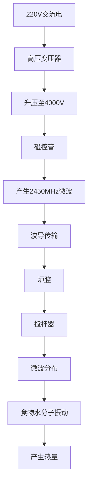

微波炉通过微波使水分子振动产生热量：
1. **产生微波**：磁控管将电能转换为2450MHz微波
2. **传输微波**：波导将微波传输到炉腔
3. **加热食物**：微波使食物中的水分子高速振动，产生热量
4. **均匀加热**：转盘或搅拌器使微波均匀分布

#### 主要部件

- **磁控管**：产生微波的核心部件
- **高压变压器**：为磁控管提供高压电
- **波导**：传输微波到炉腔
- **转盘电机**：带动转盘旋转
- **控制面板**：设置时间和功率
- **门开关**：安全保护，开门断电

#### 常见故障及修复

**故障1：微波炉不加热**

可能原因：
- 磁控管故障
- 高压变压器故障
- 高压电容损坏
- 门开关故障

修复方法：
1. 检查门开关是否正常
2. 检查高压变压器输出
3. 检查磁控管电阻
4. 检查高压电容

**故障2：加热不均匀**

可能原因：
- 转盘不转
- 搅拌器故障
- 食物摆放不当

修复方法：
1. 检查转盘电机
2. 检查搅拌器
3. 调整食物摆放位置
4. 中途翻动食物

#### 最佳使用实践

- 不要使用金属容器
- 使用微波炉专用容器
- 加热时避免密封容器
- 加热前在食物上覆盖微波炉专用盖
- 避免空载运行

#### 维护建议

- 定期清洁炉腔
- 清洁转盘和支架
- 保持通风口畅通
- 不要使用金属清洁工具
- 清洁前拔掉电源

---

## 三、清洁类电器

### 1. 洗衣机

洗衣机通过机械摩擦和化学作用实现衣物清洁，是现代家庭的重要电器。

#### 运行原理

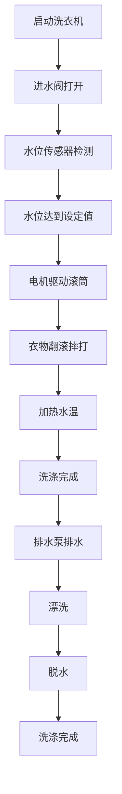

滚筒洗衣机通过机械摩擦和化学作用实现衣物清洁：
1. **进水**：进水阀打开，水位达到设定值后停止
2. **加热**：加热管将水加热至适宜温度（部分程序）
3. **洗涤**：滚筒转动，衣物在滚筒中翻滚、摔打
4. **漂洗**：排水后进水，进行多次漂洗
5. **脱水**：高速旋转，利用离心力脱去水分

#### 主要部件

- **电机**：提供转动动力
- **滚筒**：容纳衣物，实现摔打洗涤
- **进水阀**：控制进水
- **排水泵**：排出污水
- **加热管**：加热水温（部分型号）
- **控制板**：程序控制中心

#### 常见故障及修复

**故障1：洗衣机不进水**

可能原因：
- 进水阀故障
- 水压过低
- 水龙头未开
- 滤网堵塞

修复方法：
1. 检查水龙头是否打开
2. 检查进水阀滤网是否堵塞
3. 检查水压是否正常
4. 检查进水阀供电

**故障2：洗衣机不排水**

可能原因：
- 排水泵故障
- 排水管堵塞
- 排水泵叶轮卡住

修复方法：
1. 检查排水管是否堵塞
2. 检查排水泵叶轮
3. 检查排水泵供电
4. 清理过滤器

#### 最佳使用实践

- 分类洗涤，颜色深浅分开
- 不要超载
- 使用适量的洗衣液
- 洗涤前检查衣物口袋
- 洗涤后及时取出衣物

#### 维护建议

- 定期清理滤网
- 定期清洁滚筒
- 保持洗衣机干燥
- 定期检查水管接口
- 使用后保持机门开启

---

### 2. 吸尘器

吸尘器通过气流产生压差实现吸尘，是家庭清洁的重要工具。

#### 运行原理

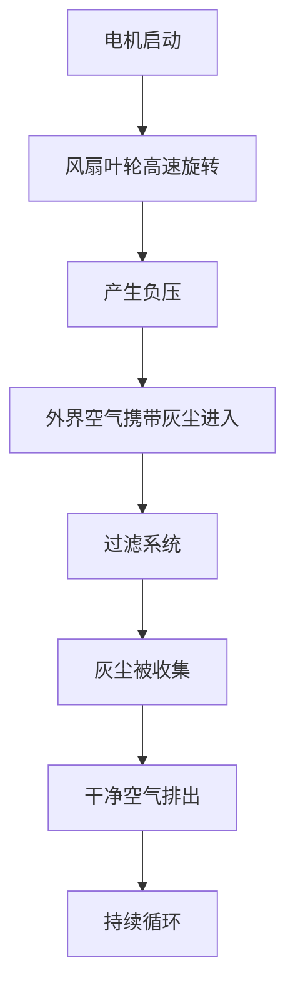

吸尘器通过气流产生压差实现吸尘：
1. **电机转动**：电机带动风扇叶轮高速旋转
2. **产生负压**：叶轮将空气从吸尘口排出，形成负压
3. **吸入灰尘**：外界空气携带灰尘进入吸尘口
4. **过滤分离**：灰尘被滤网/尘袋收集，干净空气排出

#### 主要部件

- **电机**：提供动力，带动风扇旋转
- **风扇叶轮**：产生气流和吸力
- **过滤系统**：HEPA滤网、尘袋等
- **吸尘软管**：传输气流
- **地刷/吸头**：接触地面，吸入灰尘
- **集尘盒/尘袋**：收集灰尘

#### 常见故障及修复

**故障1：吸尘器吸力下降**

可能原因：
- 滤网/尘袋堵塞
- 吸尘管堵塞
- 电机碳刷磨损
- 密封不良

修复方法：
1. 清理或更换滤网/尘袋
2. 检查并清理吸尘管和软管
3. 检查各连接处密封
4. 检查电机碳刷

**故障2：吸尘器不运转**

可能原因：
- 电源问题
- 电机故障
- 过热保护
- 开关故障

修复方法：
1. 检查电源线和插座
2. 检查电源开关
3. 让电机冷却后再试
4. 检查电机绕组

#### 最佳使用实践

- 先整理后吸尘，捡拾大块杂物
- 从里到外吸尘
- 调整吸力档位
- 定期清洁滤网
- 不要吸入液体和易燃物

#### 维护建议

- 每次使用后清理集尘盒/尘袋
- 每月清洗一次滤网
- 定期检查吸尘管
- 不要吸入易燃物品
- 不要在潮湿地面使用

---

## 四、舒适类电器

### 1. 电风扇

电风扇通过电机驱动叶片旋转产生空气流动，是夏季降温的必备电器。

#### 运行原理

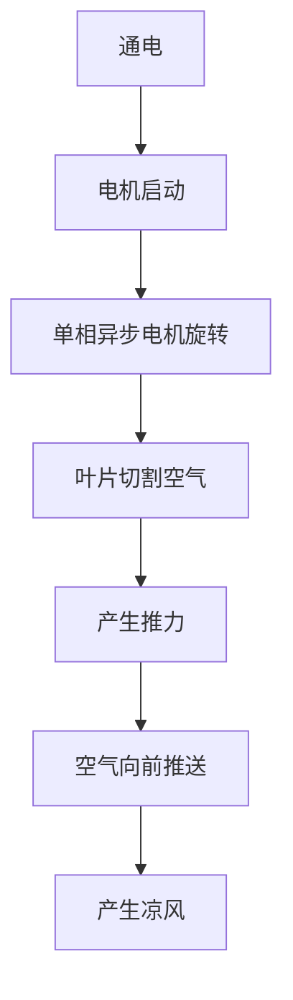

电风扇通过电机驱动叶片旋转产生空气流动：
1. **电机驱动**：单相异步电机通电后产生旋转磁场，带动叶片旋转
2. **叶片切割空气**：旋转的叶片不断切割空气，产生推力将空气向前推送
3. **摇头机构**：通过齿轮或电机带动底座或叶片转动，改变送风方向
4. **调速原理**：通过改变电机绕组匝数或电子调速器改变转速

#### 主要部件

- **电机**：单相异步电机或直流电机，提供旋转动力
- **风扇叶片**：通常为3-5片，产生送风效果
- **电容器**：单相电机的启动和运行电容
- **调速开关**：机械或电子调速，控制电机转速
- **摇头电机**：驱动摇头机构的微型电机
- **摇头齿轮组**：将摇头电机的旋转转换为往复运动

#### 常见故障及修复

**故障1：电风扇不转**

可能原因：
- 电源问题
- 电机绕组烧毁
- 启动电容损坏
- 调速开关接触不良

修复方法：
1. 检查电源线和插座
2. 检查调速开关
3. 手动转动叶片检查是否卡住
4. 检查电容

**故障2：噪音过大**

可能原因：
- 轴承磨损或缺油
- 叶片松动或不平衡
- 电机固定螺丝松动
- 齿轮箱缺油

修复方法：
1. 紧固叶片螺丝
2. 给轴承加润滑油
3. 紧固电机固定螺丝
4. 给摇头齿轮加润滑脂

#### 最佳使用实践

- 风扇对准人吹效果最佳
- 配合空调使用
- 使用摇头功能
- 选择合适档位
- 定时功能善用
- 不要连续长时间使用

#### 维护建议

- 每季度清洁叶片和防护网
- 每年给电机轴承加润滑油
- 定期检查电源线
- 长期不用时清洁后用防尘罩罩好
- 清洁和维修前必须拔掉电源

---

### 2. 空气净化器

空气净化器通过多重过滤技术净化室内空气，改善空气质量。

#### 运行原理

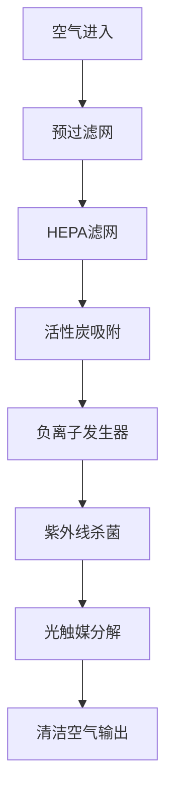

空气净化器通过多重过滤技术净化室内空气：
1. **预过滤**：拦截大颗粒灰尘、毛发等
2. **HEPA过滤**：过滤PM2.5等细微颗粒
3. **活性炭吸附**：吸附甲醛、苯等有害气体
4. **负离子杀菌**：释放负离子，沉降颗粒物
5. **紫外线消毒**：杀灭细菌和病毒

#### 主要部件

- **预过滤网**：拦截大颗粒灰尘
- **HEPA滤网**：高效过滤细微颗粒
- **活性炭滤网**：吸附有害气体
- **负离子发生器**：释放负离子
- **紫外线灯**：杀菌消毒
- **风扇电机**：产生气流

#### 常见故障及修复

**故障1：净化效果差**

可能原因：
- 滤网堵塞
- 风机转速下降
- 房间面积过大

修复方法：
1. 清洁或更换滤网
2. 检查风机转速
3. 选择合适功率的空气净化器
4. 关闭门窗使用

**故障2：噪音过大**

可能原因：
- 风扇轴承磨损
- 滤网堵塞
- 安装不牢固

修复方法：
1. 清洁或更换滤网
2. 检查风扇轴承
3. 紧固安装螺丝

#### 最佳使用实践

- 关闭门窗使用
- 定期清洁或更换滤网
- 选择合适的风速档位
- 不要放在潮湿环境
- 定期检查滤网寿命指示

#### 维护建议

- 定期清洁预过滤网
- 定期更换HEPA滤网和活性炭滤网
- 保持机器清洁干燥
- 不要使用劣质滤网
- 发现异响及时维修

---

## 五、出行工具

### 1. 电动自行车

电动自行车以电池为动力源，通过控制器驱动电机运转，是一种环保便捷的交通工具。

#### 运行原理

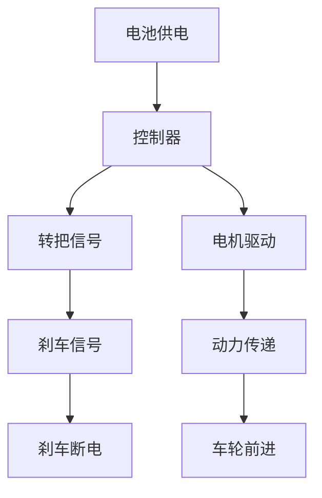

电动自行车以电池为动力源，通过控制器驱动电机运转：
1. **电池供电**：锂电池或铅酸电池存储电能，为整个系统提供动力
2. **控制器处理**：控制器接收转把信号和刹车信号，处理后输出电机驱动信号
3. **电机运转**：无刷电机或无刷直流电机根据控制器信号产生旋转动力
4. **动力传递**：电机通过链条或齿轮将动力传递给车轮，驱动车辆前进

#### 主要部件

- **电池**：36V或48V锂电池/铅酸电池，存储电能的核心部件
- **控制器**：控制电机转速和车辆运行的核心电子部件
- **电机**：无刷直流电机或有刷电机，将电能转化为机械能
- **转把**：控制车辆加速的部件，通过旋转角度调节速度
- **刹车断电开关**：刹车时切断电机电源，实现刹车断电功能
- **仪表盘**：显示速度、电量、里程等信息的显示设备

#### 常见故障及修复

**故障1：电动自行车不启动**

可能原因：
- 电池电量不足
- 控制器故障
- 电机故障
- 转把故障

修复方法：
1. 检查电池电量
2. 检查控制器供电
3. 检查电机霍尔传感器
4. 检查转把信号

**故障2：续航里程下降**

可能原因：
- 电池老化
- 轮胎气压不足
- 负载过重
- 刹车阻力过大

修复方法：
1. 检查电池容量
2. 检查轮胎气压
3. 减轻负载
4. 检查刹车调整

#### 最佳使用实践

- 定期充电，避免电量耗尽
- 避免过度充电
- 充电时关闭电源
- 避免在雨天长时间骑行
- 定期检查轮胎气压和刹车

#### 维护建议

- 定期清洁车辆
- 检查螺丝是否松动
- 检查刹车系统
- 定期润滑链条
- 发现故障及时维修

---

## 六、电路照明

### 1. 墙上插座

墙上插座是家庭用电取电的核心部件，主要有10A、16A等不同规格。

#### 插座类型

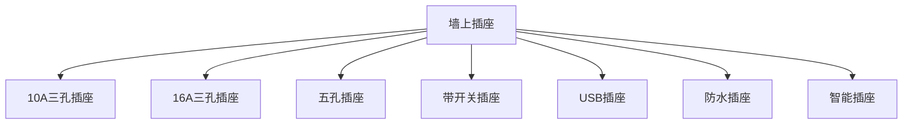

常见插座类型：
- **10A三孔插座**：最常见的家用插座，适用于小功率电器
- **16A三孔插座**：大功率插座，用于空调、电热水器等
- **五孔插座**：二三插孔组合，使用更灵活
- **带开关插座**：插座附带开关控制，通断电更方便
- **USB插座**：集成USB充电口，方便手机等设备充电
- **防水插座**：带有防溅盒，适用于厨房、卫生间

#### 主要部件

- **插座面板**：外部可见的塑料面板，保护内部结构
- **插孔铜片**：与插头接触的弹性铜片，传输电流
- **接线端子**：连接电源线的金属端子
- **底盒**：安装在墙内的塑料或金属盒子
- **保护门**：防止异物进入的安全设计

#### 常见故障及修复

**故障1：插座不通电**

可能原因：
- 接线端子松动或脱落
- 铜片失去弹性
- 线路中间断路
- 配电箱断路器跳闸

修复方法：
1. 切断电源，用万用表测量插座电压
2. 拆开插座面板，检查接线是否牢固
3. 检查铜片是否变形、烧蚀
4. 检查配电箱断路器状态

**故障2：插座发热**

可能原因：
- 插头与插座接触不良
- 负载功率超过插座额定功率
- 接线端子松动

修复方法：
1. 检查插头是否插紧
2. 减少负载功率
3. 紧固接线端子
4. 必要时更换插座

#### 最佳使用实践

- 不要超负荷使用
- 潮湿环境使用防水插座
- 不要湿手插拔插头
- 发现插座松动及时更换
- 大功率电器使用16A专用插座

#### 维护建议

- 定期检查插座是否松动
- 发现插座发热及时处理
- 不要强行插拔插头
- 定期清理插座灰尘
- 发现异常及时维修

---

### 2. 墙上开关

墙上开关是家庭电路控制的核心部件，主要有单控、双控、智能开关等类型。

#### 开关类型

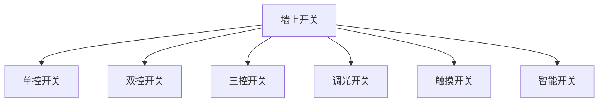

常见开关类型：
- **单控开关**：在一个位置控制一盏灯
- **双控开关**：两个开关控制同一盏灯
- **三控开关**：三个开关控制同一盏灯
- **调光开关**：可调节灯光亮度
- **触摸开关**：电容式触摸感应控制
- **智能开关**：支持手机APP、语音控制

#### 主要部件

- **开关面板**：外部可见的塑料面板，保护内部结构
- **开关模块**：核心机械或电子开关部件
- **接线端子**：连接电源线和负载线的金属端子
- **底盒**：安装在墙内的塑料或金属盒子
- **弹簧机构**：机械开关的复位弹簧
- **触点**：开关闭合时接通电流的金属触点

#### 常见故障及修复

**故障1：开关无法控制灯具**

可能原因：
- 开关内部触点烧蚀或氧化
- 接线端子松动或脱落
- 控制线断路
- 开关机械结构损坏

修复方法：
1. 切断电源，用万用表测量开关两端电阻
2. 检查接线端子是否紧固
3. 拆开开关面板，检查内部触点
4. 必要时更换开关

**故障2：开关发热**

可能原因：
- 负载功率超过开关额定功率
- 接线端子接触不良
- 开关老化，触点电阻增大

修复方法：
1. 检查所接灯具功率
2. 检查并紧固所有接线端子
3. 触摸开关外壳温度，异常发热时及时更换
4. 检查线路绝缘情况

#### 最佳使用实践

- 不要超负荷使用
- 不要湿手操作开关
- 发现开关松动及时紧固
- 开关损坏及时更换
- 智能开关定期更新固件

#### 维护建议

- 定期检查开关是否松动
- 发现开关发热及时处理
- 不要强行开关
- 清洁开关时断电
- 发现异常及时维修

---

## 总结

通过本文的详细介绍，相信大家对家用电器有了更深入的了解。每种电器都有其独特的运行原理和构造，掌握这些知识不仅可以帮助我们更好地使用和维护电器，还能在出现故障时进行初步的排查和处理。

### 日常使用注意事项

1. **安全第一**：所有电器操作都应注意安全，避免触电和火灾风险
2. **定期维护**：定期清洁和检查电器，延长使用寿命
3. **合理使用**：按照说明书正确使用，避免超负荷和错误操作
4. **及时维修**：发现故障及时处理，避免小问题变成大问题
5. **节能环保**：合理设置参数，节约能源，保护环境

### 故障处理原则

1. **先断电后检查**：所有维修操作前必须切断电源
2. **从简单到复杂**：先检查电源、开关等简单问题，再检查复杂部件
3. **记录故障现象**：详细记录故障发生时的现象，便于维修人员判断
4. **专业维修**：涉及高压电或复杂维修时，请专业人员进行
5. **安全警示**：设置警示标志，避免他人误操作

希望本文能够帮助大家更好地了解和使用家用电器，让我们的生活更加便利、舒适、安全！

---

*本文档由家用电器维修指南网站整理而来，内容仅供参考，实际维修请以专业意见为准。*